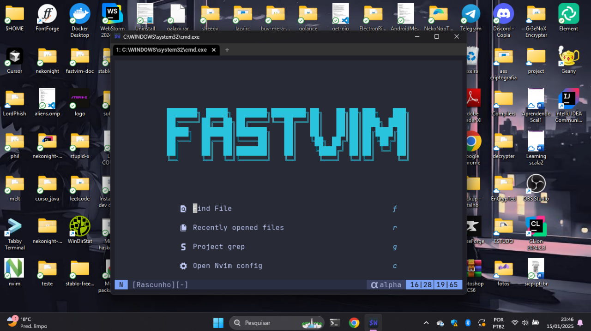
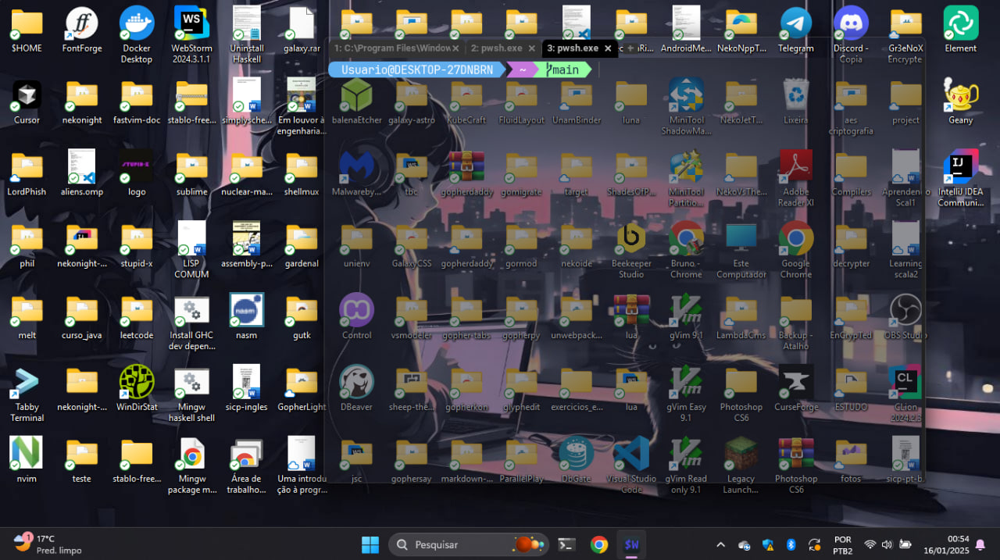

# dotfiles (>^.^<)

These are my personal dotfiles, including my `.bashrc`, the FastVim distro derived from my personal Neovim configuration, my WezTerm configuration, and my Emacs configuration.

## Requirements

-   **Neovim**: >= **0.10.3** (built with **LuaJIT**).
-   **Git**: >= **2.19.0** (supports partial clones).
-   [**FastVim**](https://github.com/fastvim/fastvim): My custom Neovim configuration.
-   A [**Nerd Font**](https://www.nerdfonts.com/) (v3.0 or greater): **Optional**, but necessary for some icons.
-   A **C compiler** for `nvim-treesitter`. See [nvim-treesitter requirements](https://github.com/nvim-treesitter/nvim-treesitter#requirements).
-   **Telescope.nvim** dependencies (optional):
    -   **live grep**: [ripgrep](https://github.com/BurntSushi/ripgrep).
    -   **find files**: [fd](https://github.com/sharkdp/fd).
-   A terminal supporting true color and _undercurl_:
    -   [WezTerm](https://github.com/wez/wezterm) **(Linux, macOS, Windows)**.
    -   [Alacritty](https://github.com/alacritty/alacritty) **(Linux, macOS, Windows)**.
    -   [iTerm2](https://iterm2.com/) **(macOS)**.
-   [**nekonight**](https://github.com/BrunoCiccarino/nekonight): My custom colorscheme.
-   [**YouCompleteMe**](https://github.com/ycm-core/YouCompleteMe): Autocompletion and code navigation.
-   [**npm**](https://www.npmjs.com/): Required for vim-prettier.
-   [**fzf**](https://github.com/junegunn/fzf): Required for vim config

## Why Vim?

First off, why am I even using Vim in 2025 when IDEs like VSCode come with all the bells and whistles? Simple: **speed** and **focus**. Vim is like that old reliable friend who’s always there for you, doesn’t crash, and doesn’t hog your RAM. Sure, it takes some time to get used to, but once you do, there’s no going back.

Before we dive into my Vim configuration, let me introduce my terminal emulator of choice: **WezTerm**. It’s fast, highly customizable, and feels incredibly responsive. Perfect for running Vim, Git, Node.js, or whatever else I throw at it.

## My WezTerm Configuration

Before we dive into my Vim setup, let’s talk about the terminal emulator that makes everything tick: **WezTerm**. If you’ve never used it, think of it as the terminal equivalent of a high-performance sports car—it’s sleek, fast, and incredibly powerful.

I chose WezTerm for a few key reasons:

1. **True Color and Undercurl Support**: It supports true color and undercurl, making themes like [nekonight](https://github.com/BrunoCiccarino/nekonight) look stunning.
2. **Cross-Platform Consistency**: Whether I’m on Windows or Linux, WezTerm provides a uniform experience.
3. **Customizability**: It’s highly customizable, allowing me to tailor the terminal exactly how I like it.

Here’s a quick overview of my configuration:

### Launch Menu

I’ve set up a launch menu to quickly switch between different shells, depending on my needs:

-   **Windows**: Options include PowerShell and PowerShell without profiles for faster startup times.
-   **Linux**: Similarly, I have entries for PowerShell, tailored to Linux environments.

This makes it easy to launch the right shell for the task at hand without fiddling with manual configurations.

### Default Program

By default, I’ve set WezTerm to launch PowerShell (`pwsh.exe`), ensuring a modern shell experience right out of the gate. For Linux, it defaults to `/usr/local/bin/pwsh`.

### Fonts and Colors

Fonts and colors are crucial for readability and aesthetics:

-   **Font**: I’m using `JetBrains Mono` as the primary font, with fallbacks like `Fira Code` and `Consolas` for compatibility.
-   **Color Scheme**: The terminal uses the `Dracula` theme, which provides excellent contrast and is easy on the eyes during long coding sessions.

### Keybindings

To streamline workflows, I’ve customized the keybindings to match my needs. For example:

-   Ctrl+C and Ctrl+Shift+C for copying to clipboard.
-   Ctrl+V for pasting from clipboard.
-   Ctrl+Tab for switching to the next tab.
-   Ctrl+Shift+Tab for switching to the previous tab.
-   Alt+Enter to toggle fullscreen mode.
-   Ctrl+1 to Ctrl+9 for activating tabs by index.
-   Ctrl+Shift+Number to activate corresponding tabs by index with shift.
-   Ctrl+`%` and Shift+Ctrl+`%` for horizontal split.
-   Ctrl+`"` and Shift+Ctrl+`"` for vertical split.
-   Ctrl+= and Ctrl+Shift+= to increase font size.
-   Ctrl+- and Ctrl+Shift+- to decrease font size.
-   Ctrl+0 to reset font size.
-   Ctrl+K and Ctrl+Shift+K to clear scrollback.
-   Ctrl+F and Ctrl+Shift+F to search in the terminal.
-   Ctrl+R and Ctrl+Shift+R to reload configuration.
-   Ctrl+T and Ctrl+Shift+T to show the launcher.
-   Ctrl+U and Ctrl+Shift+U for character selection with clipboard copy.
-   Ctrl+W and Ctrl+Shift+W to close the current tab with confirmation.
-   Ctrl+X and Ctrl+Shift+X to activate copy mode.
-   Ctrl+Z and Ctrl+Shift+Z to toggle pane zoom state.
-   Shift+Super+[ and Shift+Super+] to activate the previous or next tab respectively.
-   Ctrl+N to spawn a new window.
-   Ctrl+P to activate the command palette.
-   Ctrl+M to hide the terminal.
-   Ctrl+L and Ctrl+Shift+L to show the debug overlay.
-   Ctrl+Alt+Number for split operations using pane domains.

### Pane Management

Split panes are an essential feature, allowing me to work on multiple tasks simultaneously. My configuration supports both horizontal and vertical splits with intuitive shortcuts like `Ctrl+"` and `Ctrl+%`.

### Performance Enhancements

Finally, WezTerm is optimized for performance with settings like:

-   `enable_wayland = false` for compatibility with my setup.
-   `term = "xterm-256color"` to ensure compatibility with various applications.

---

With this setup, WezTerm becomes the perfect companion for running Vim. The responsiveness, visuals, and flexibility it offers make it a joy to use, complementing the efficiency of Vim itself. Now, let’s move on to the Vim configuration and see how it all comes together.

## How Does My Vim Config Work?

Alright, let’s talk about how this Vim configuration works and how you can navigate it. This setup works seamlessly on both **Windows** and **Linux**, with identical keybindings for consistency.

### Keybindings: A Quick Guide

Here’s how I’ve customized the keybindings to make navigation and editing a breeze:

1. **Escape Insert Mode**:

    - `jk`: Quick escape from insert mode.

2. **File Operations**:

    - `Ctrl+S`: Save the current file.
    - `Ctrl+C`: Copy the entire file to the clipboard.

3. **NERDTree**:

    - `Ctrl+N`: Open NERDTree.
    - `Ctrl+T`: Toggle NERDTree visibility.
    - `Leader+N`: Focus on the NERDTree window.

4. **Prettier**:

    - `Leader+P`: Format the current file with Prettier.

5. **Clipboard Operations**:

    - `Ctrl+V`: Paste from the system clipboard.
    - `Ctrl+Z`: Undo the last action.

6. **Terminal**:

    - `Leader+T`: Open a terminal split.

7. **Search and Navigation**:

    - `Ctrl+F`: Open NERDTree at the current file.
    - `Leader+F`: Jump to a specific function or search.

8. **Movement Enhancements**:
    - `Alt+Up` or `Alt+Down`: Move lines up or down.

### FZF Integration

I’ve added [fzf.vim](https://github.com/junegunn/fzf.vim) to enhance file searching and navigation:

-   **Files Search**:
    -   `Ctrl+P`: Quickly find and open files in the project.
-   **Buffer Navigation**:
    -   `Leader+B`: Switch between open buffers.
-   **Project Search**:
    -   `Leader+G`: Search for text across the entire project using `ripgrep`.
-   **Current Buffer Search**:
    -   `Leader+/`: Search within the current buffer.
-   **Word Search**:
    -   `Leader+*`: Find occurrences of the word under the cursor in the project.

Make sure you have `fzf` and `ripgrep` installed to fully utilize these features.

### Colorscheme

The default colorscheme is [nekonight-night](https://github.com/BrunoCiccarino/nekonight). It’s designed to provide a clean, distraction-free dark theme optimized for coding.

### Clipboard Integration

Clipboard integration is enabled by default:

-   Copy and paste seamlessly between Vim and your system clipboard using `Ctrl+C` and `Ctrl+V`.

### ALE and Prettier

-   **Linting and Fixing**:
    -   ALE is configured to lint and fix files automatically on save.
    -   Prettier ensures your code stays formatted according to best practices.

### Custom Terminal Commands

For advanced workflows, open an integrated terminal within Vim using `Leader+T`. This allows you to run commands without leaving the editor.

## How Does My Emacs Config Work?

Let’s break down how my Emacs configuration works and how you can navigate it. This setup provides a smooth experience for developers, focusing on productivity and customization. It’s designed to work seamlessly on both **Linux** and **Windows**, with consistent keybindings across platforms.

### Keybindings: A Quick Guide

Here are some custom keybindings that make navigation and editing easier:

1. **File Operations**:
    - **Ctrl + C + F**: Open Dired (file explorer) in the current directory.
    - **Ctrl + C + B**: Load a theme selection menu for quick theme switching.
    - **Ctrl + C + Q**: Save all buffers and quit Emacs.

2. **Eshell and Terminal**:
    - **Ctrl + C + S**: Open Eshell in a new split window.
    
3. **Move Lines**:
    - **Alt + ↑ / ↓**: Move the current line up or down. This helps in quickly rearranging code lines without leaving edit mode.

4. **Compiling Code**:
    - **F9**: Compile a simple C/C++ file without needing a Makefile. It automatically detects the file type and uses `gcc` or `g++`.

5. **Evaluating Code**:
    - **Ctrl + C + C + E**: Evaluate the last expression.
    - **Ctrl + C + C + R**: Evaluate the selected region.

6. **Theme Switching**:
    - **Ctrl + C + B**: Switch between different themes easily with a Hydra menu.

### Theme and Visual Customizations

The configuration uses `doom-themes` for a modern, pleasant interface. By default, the **gruber-darker** theme is applied. Emacs’ interface is also streamlined to focus on coding by disabling the toolbar, menu bar, and scroll bars.

- **Fringe Mode**: Set to 15 pixels for better readability.
- **Line Numbers**: Enabled globally to show line numbers in all buffers.
- **Visual Line Mode**: Enabled to prevent text from breaking mid-word.
- **Column Number**: Displays the current column number for precise editing.

### Package Management with `use-package`

This setup uses `use-package` to manage Emacs packages, ensuring that all necessary dependencies are installed automatically. Key repositories are configured:

- **MELPA**: For modern, updated packages.
- **Org Mode**: For handling notes and tasks.
- **GNU ELPA**: For stable, official Emacs packages.

### LSP Integration

- **LSP Mode**: Integrated to provide autocompletion, code linting, and navigation for various programming languages, like Python.
- **lsp-pyright**: Specifically for Python, enabling language server support via Pyright.
- **lsp-ui**: Enhances the LSP experience with UI elements like documentation popups and code lenses.

### Additional Customizations and Plugins

- **Hydra**: Used for quick command menus. For example, the theme switching menu is a Hydra that pops up with `Ctrl + C + B`.
- **Paredit**: Installed for working with Lisp-like languages (e.g., Scheme, Clojure). Automatically activated in `emacs-lisp-mode`, `ielm-mode`, `slime-repl-mode`, etc.
- **Rainbow Delimiters**: Adds colorful parentheses and brackets to make it easier to visualize nested code blocks.
- **SLIME**: Configured for better Common Lisp interaction.
- **All The Icons**: Adds icons to various parts of Emacs for a more visually appealing interface.
- **Vertico & Vertico Posframe**: Provides enhanced vertical completion and autocompletion, with Vertico’s posframe offering a cleaner popup interface for completions.

### Code Compilation for C/C++

- **F9**: Compiles the current C or C++ file directly, without requiring a Makefile. It automatically determines whether to use `gcc` or `g++` based on the file extension.

### File Type Support

The configuration includes custom `auto-mode-alist` entries for various file types:

- **Scheme Files**: Automatically opens in `scheme-mode`.
- **Lisp Files**: Open in `lisp-mode`.
- **Emacs Lisp**: Opens with `emacs-lisp-mode`.
- Custom mode files for **Haskell**, **C**, and **Assembly** are also loaded.

### How to Use It

1. **Open Dired**:
   - **Ctrl + C + F**: Opens the Dired file explorer in the current directory.

2. **Compile C/C++ Code**:
   - **F9**: Compiles the C/C++ file in the current buffer without needing a Makefile.

3. **Quick Theme Switching**:
   - **Ctrl + C + B**: Opens a Hydra menu to change the theme.

4. **Move Lines**:
   - **Alt + ↑ / ↓**: Move lines of code up or down quickly.

5. **Work with Lisp**:
   - **Paredit** is enabled for all Lisp-related modes (`emacs-lisp-mode`, `lisp-mode`, `ielm-mode`, etc.), providing smart editing support.

6. **LSP Features**:
   - With **LSP** and **lsp-pyright**, you get advanced code completion, error highlighting, and documentation popup for Python.

---

### About me

I’m a Brazilian full stack dev, I’m a lua language enthusiast, addicted to neovim/vim and its entire ecosystem, proficient in c, javascript and lua. I like writing about programming and I’m quite curious!

See more about my career on my blog, it's an extension of my brain, everything I learn new I post there.

-   [ciccabruno](https://ciccabruno.vercel.app/)

